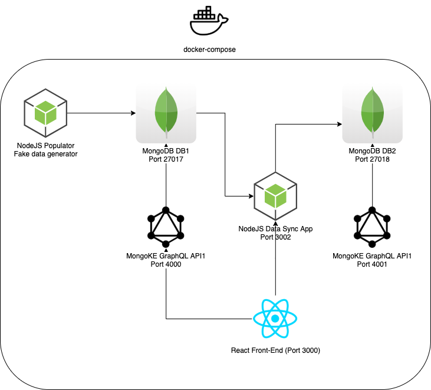

# Clarity FM Coding Challenge
Angelo Perera

## Challenge description
---
1.	Create a database of sample data including the following

    a)	Supplier name

    b)	Supplier number

    c)	Services provided, eg electrical, plumbing, etc (include 10)
  
    d)	Work orders which incl:

        i.	Date work order due
        ii.	Date work order completed
        iii.	Priority 1-3
        iv.	Service report provided yes/no
    e)	Number of sent messages

    f) Number of received messages
  
2.	Create a separate db with a simple ui directory of suppliers that has its own db but synchronises data from the db in 1.

3.	The db in 2. should have a rating system out of 10 with one decimal place that rates suppliers with a weighted average based on:

    a.	Ratio of work orders completed before due date to after due date, weighted by priority where 1 (100%) is highest priority, 2 (60%) and 3 is lowest (30%)
    
    b.	Ratio of sent to received messages

---

## System Requirements
> This has been tested in Mac Os Catalina but should run fine in linux with the same instructions and with windows - however with some varied commands (volume mounts may not work). Please message angeloperera@gmail.com for help!
* Docker (docker-compose)
* NodeJS (Optional - For debugging, otherwise can run fine in docker-compose)


## Technology Used
* MongoDB (Containerised)
* GraphQL (Containerised, MongoKe)
* ReactJS (Containerised, Apollo, GraphQL)


## Methodology Design Description
I have chosen to use docker to host this application as it allows me to use MongoDB, GraphQL, NodeJS and ReactJS in a consistent and predictable manner



## How to run
Run in terminal:
```bash
docker-compose up --build --remove-orphans
```

* Visit: http://localhost:3000 for React App (Database 1 and 2)

Debugging URLS:
* Visit: http://localhost:4000 for GraphQL UI for MongoDB1 - Main DB
* Visit: http://localhost:4001 for GraphQL UI for MongoDB2 - Synced DB with ratings
* Visit: http://localhost:3002 for DB Sync Back-End(NodeJS)


## GraphQL
Schema:
```yml
 type Supplier {
    _id: ObjectId
    name: String
    number: Int
    Telephone: String
    messages_sent: Int
    messages_recv: Int
    service_ids: [ObjectId]
}

type Service {
    _id: ObjectId
    name: String
    description: String
}

type WorkOrder {
    _id: ObjectId
    supplierid: ObjectId
    description: String
    date_due: Date
    date_completed: Date
    priority: Int
    report_provided: Boolean
}
```

Relationships:
```yml
relations:
    -   field: workorders
        from: Supplier
        to: WorkOrder
        relation_type: to_many
        where:
            supplierid: ${{ parent['_id'] }}
    -   field: services
        from: Supplier
        to: Service
        relation_type: to_many
        where:
            _id: 
                $in: ${{ parent['service_ids'] }}            
```

Queries:
Get Suppliers
```yml
{
  Suppliers(first: 1000) {
    nodes {
     name,
      number,
      messages_sent,
      messages_recv,
      workorders(first:100){
        nodes{
          description,
          date_due,
          date_completed,
          priority,
          report_provided
        }
      },
      services(first:100){
        nodes{
          name,
          description
        }
      }
    }
  },
}
```